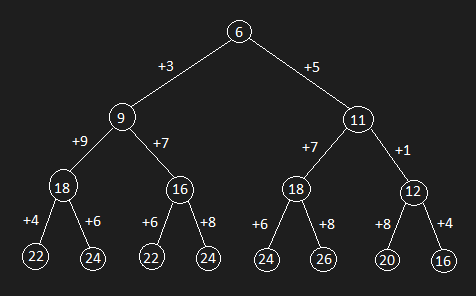
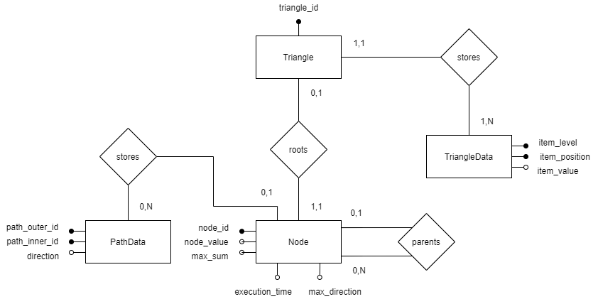

# Teste de Lógica - WAAC

Leia primeiro toda a proposta, faça sua estimativa de horas do planejamento a ser realizado, explique a estratégia a ser seguida de acordo com as tecnologias que escolheu e envie um e-mail com o título **[Fullstack] Teste do Triângulo - Estimativa** para beawsome@waac.com.br com o link do seu git.
O primeiro commit é somente com o README.MD e esse arquivo será o seu documento técnico, portanto os processos de evolução precisam ser descritas e commitadas nesse arquivo. Tenha o hábito de commitar cada evolução ao longo da realização do projeto. Não suba o projeto no git apenas quando estiver pronto.

------

Estimativa de horas:

Preparo - 4 horas (tempo gasto não cronometrado)  
Desenvolvimento da árvore - 2 horas (tempo gasto: 2:40 horas)  
Desenvolvimento do banco de dados + Integração - 15 horas 
Nova estimativa para desenvolvimento do BD + Integração - 18 horas (tempo gasto: 22:40 horas)
Finalização das funcionalidades - 5 horas (tempo gasto atm 4:30 horas)

## O Desafio

Dado um triângulo de números, encontre o total máximo de cima para baixo.

## O triângulo

                6
            3       5
        9       7       1
    4       6       8       4    

    Nesse triângulo, o total máximo é 6 + 5 + 7 + 8 = 26.

## Requisitos

Um elemento só pode ser somando com um dos dois elementos mais próximos da próxima linha. Assim, o elemento 3 na linha 2 pode ser somado com 9 e 7, mas não com 1.

## A sua estratégia

Escolha a linguagem de programação desejada e deixo nos saber a sua estratégia por trás da eleboração do problema.

------

Linguagem: JavaScript para a resolução do problema, especificada durante a entrevista.

Entendendo o problema:

Sabe-se que partindo do algarismo no topo do triângulo, há a opção de seguir o caminho esquerdo ou o caminho direito, para prosseguir com a soma. Destas opções, temos novamente uma opção de seguir para a esquerda ou direita, totalizando quatro caminhos. Isso se repete para todo algarismo exceto pelos da base, formando uma estrutura de árvore.

  
Figura 1 - Árvore baseada no triângulo exemplo.

Como a árvore é gerada a partir de um triângulo onde o topo apresenta apenas um algarismo, e o número de algarismos cresce em um, e somente um, a cada nível até a base, a árvore gerada será obrigatoriamente uma árvore binária cheia.

Desta forma, para se resolver o problema, basta se fazer uma busca em profundidade por toda a árvore e ao se chegar em uma folha, verificar se o novo caminho obtido é maior do que o previamente maior, atualizando ele caso positivo.

Melhorando a resolução:

Nota-se que se, partindo das folhas, se soubermos que o valor máximo que pode ser obtido partindo-se de tal vértice da árvore, e o caminho pelo qual pode-se obter tal valor, o vértice do nível superior pode simplesmente comparar os máximos dos seus filhos para determinar qual o melhor caminho para se seguir. Dessa forma, o valor máximo que pode-se obter a partir do vértice, e o caminho pelo qual se pode obtê-lo, também são valores interessantes de se guardar no próprio vértice.

Pontos importantes:

Também é importante notar que nem sempre é necessário se chegar às folhas. Se o próximo caminho a ser analisado já for maior do que o máximo atual antes de se chegar em alguma folha desse novo caminho, a o valor máximo já pode ser atualizado. Isso não é válido caso números negativos sejam aceitos na entrada, entretanto.

Ainda se preocupando com a entrada, pode ser necessário validar o que o usuário inseriu como entrada, haja vista que há a possibilidade dele ter utilizado valores não numéricos ou sintaxe errada nos colchetes e vírgulas. A entrada também pode ser longa demais, fazendo com que o problema não possa ser resolvido em um tempo bom.

Uma última preocupação com o tipo de entrada é que apesar de ser numérica devido à natureza do problema, não foi indicado se esta pode conter números não-inteiros. Baseando-se no exemplo dado e adotando bom-senso, a resolução será feita com base em inteiros, mas esta é uma decisão arbitrária consequente da falta de especificações.

Haja vista que dois, ou mais, caminhos distintos podem levar ao mesmo valor de soma, e este pode ser o máximo, pode ser necessário armazenar mais de um caminho que leva até a solução do problema.

Preparo:

Embora tenha muita experiência com árvores em C, não lidei com estruturas de dados em JavaScript, logo é necessário uma pesquisa de como implementar uma árvore na linguagem. Observando que é possível fazê-lo através do uso de classes, com orientação a objetos, isso também facilitando a concepção de um diagrama de classes, decidiu-se que tal método será utilizado para resolver o problema.

Abordagem:

Além de se resolver o problema, é necessário armazenar as listas fornecidas, as etapas do processamento com seus respectivos atributos, e uma forma de visualização. Nenhum destes itens parece afetar a resolução em si, portanto decidiu-se focar no problema inicial primeiro.

A ideia de se usar o padrão de composição para a árvore foi momentaneamente abandonada. Após se pensar um pouco mais sobre o padrão, concluiu-se que além de se aumentar a complexidade da resolução, ele também pode não ser ideal para o problema.

Após finalizada o algoritmo por trás da resolução do problema, é necessário dar atenção à obtenção, ao armazenamento e a exibição dos dados. Como a obtenção e a exibição de dados ocorrem no front-end, e podem ser resolvidas através de HTML e JavaScript, tecnologias já conhecidas, decidiu-se dar atenção ao armazenamento primeiro.

O armazenamento de informações pode ser feito através de SQL, uma vez que isto permite a criação de um banco de dados, tecnologia também conhecida, mas é necessário adquirir conhecimentos de como integrar ela ao código em HTML/JavaScript.

Antes de se criar o banco de dados, é necessário definir que informações serão armazenadas no mesmo. Para cada triângulo fornecido como entrada, devem ser guardados os valores da lista e um ID. Porém também se pede que sejam armazenadas as etapas do processamento com o tempo de execução e o método utilizado para resolução da etapa. Tendo estas especificações e a resolução em mente, decidiu-se definir cada etapa como a criação e preenchimento de informações do vértice da árvore, e o método como sendo o tipo de escolha de caminho para se obter a soma máxima.

Com isso em mente, foi projetado um diagrama entidade-relacionamento, o qual foi simplificado, uma vez que certas entidades foram identificadas como desnecessárias. A partir deste diagrama, o banco de dados foi criado, porém é necessário integrá-lo ao componentes do front end, até então não presentes. Portanto, para fins de teste de integração, deve ser projetada uma interface simples.

  
Figura 2 - Novo diagrama entidade-relacionamento.

Para que a integração ocorra, estudou-se que ela só é possível com o uso de tecnologias como PHP, Ajax e Node, as quais devem ser avaliadas e estudadas, a fim de se concluir a etapa atual.

A integração do banco de dados e das variáveis através de PHP e Ajax não retornou resultados satisfatórios, devido a problemas de instalação e dificuldade na aprendizagem. Com o prazo limite de conclusão da resolução em mente, decidiu-se que se sucesso não for obtido em tempo razoável, o aprendizado e uso de novas tecnologias pode ser abandonado, para dar foco às tecnologias já conhecidas e demonstrar domínio na área desejada, de desenvolvimento front end.

Resgatar e inserir dados no banco de dados foi possível com PHP, porém fazer uso das variáveis de JavaScript no código em PHP, através de Ajax, provou ser complicado. Dessa forma, a decisão tomada foi manter apenas a tabela dos dados do triângulo no banco de dados, e fazer a validação da entrada no próprio PHP, descartando a validação em JavaScript. Revisitando a ideia de um banco de dados mais robusto somente se sobrar tempo.

Essa decisão significa que os dados dos vértices da árvore não poderão mais ser simplesmente consultados ao se selecionar um triângulo, mas a exibição destes ainda pode ser possível, quando se gera a árvore novamente, a partir dos dados do triângulo selecionado.

Uma vez finalizada a integração, é possível finalizar o desenvolvimento. Atualizar o código para resolver o problema e vinculá-lo aos componentes de HTML deve ser a próxima etapa, com a estilização por último. Porém, uma leve estilização das divisórias pretende ser feita para facilitar a visualização durante o desenvolvimento.

## Parâmetros de entrada e de saída

Seu código receberá uma lista multidimensional como parametro. O triangulo do exemplo receberá, então: [[6],[3,5],[9,7,1],[4,6,8,4]].

## Resolução FULL-STACK

Você deverá mostrar as suas habilidades de desenvolvimento em um ambiente "full stack", portanto resolverá o desafio dentro de uma estrutura não relacional com o desenvolvimento back-end e front-end.
Para cada etapa do processo da resolução para a soma do triângulo, você deverá:

1. Armazenar a lista inserida pelo usuário com um ID;
2. Armazenar as etapas do processamento com o tempo de execução e o método utilizado para resolução da etapa;
3. Mostrar o triângulo de forma tracejada com o caminho percorrido e o resultado.

## Processo de avaliação

1. Padrões de projeto e arquitetura
2. Redibilidade
3. Teste automatizado
4. Tempo de execução
5. Estratégia
6. Escopo de tecnologias utilizadas

#### Finalização e Dúvidas

As dúvidas para a resolução da lógica do problema faz parte do teste, portanto ao passar os 7 dias mande um e-mail com o título **[Teste Fullstack] Teste do Triângulo - Finalização** para beawsome@waac.com.br mesmo se não tiver finalizado.